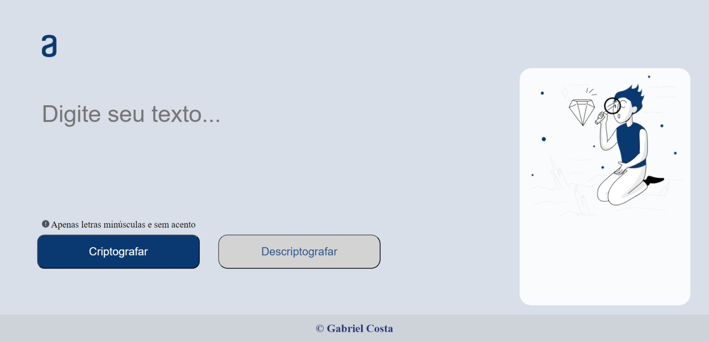

# Decodificador e Codificador 
## Desafio do curso de desenvolvimento web da alura.

## Tecnologias Usadas

- HTML
- CSS
- JavaScript

<a href = "https://decodificadorgabriel.vercel.app/"> Deploy do Projeto<a>

